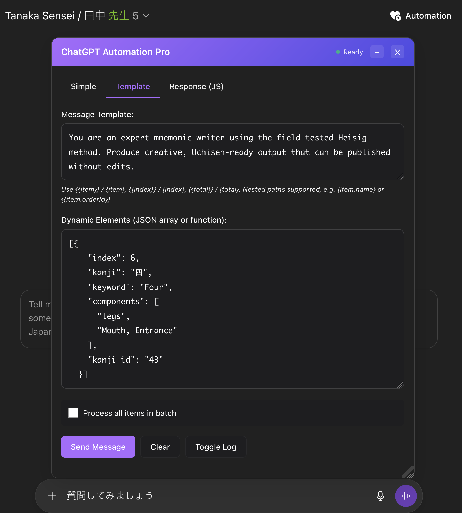

# ChatGPT Automator

Automate ChatGPT in your browser: type, send, wait, then run your code on the reply. Batch-friendly. Clean UI. Zero copy-paste.



## Install
1) Install Tampermonkey
2) Open the raw script URL and accept install:
   - https://raw.githubusercontent.com/HRussellZFAC023/ChatGptAutomator/main/chatgptAutomation.js
3) Go to chatgpt.com → click “Automation” in the header

## What it does
- Types and sends your message automatically
- Waits for ChatGPT to finish, then runs your JavaScript
- Batch mode with templates: {item.foo}, {{index}}, nested paths
- Polished panel: tabs, progress, logs, dark mode, saved position
- CORS-safe HTTP helper to call any API from your code
- Auto-detects your ChatGPT interface language via `<html lang>` and applies built-in translations to the automation panel (supports 30 languages: Albanian, Amharic, Arabic, Armenian, Bengali, Bosnian, Bulgarian, Burmese, Catalan, Chinese, Croatian, Czech, Danish, Dutch, Estonian, Finnish, French, Georgian, German, Greek, Gujarati, Hindi, Hungarian, Icelandic, Indonesian, Italian, Japanese, Kannada, Kazakh, Korean)

## Quick start
1) Simple tab: paste a message → Send
2) Template tab: add Dynamic Elements (JSON array) and a message template → Send
3) Response (JS) tab: paste code that runs after the reply

Context available to your JS: response, log, console, item, index, total, http

## Handy prompt
- JSON-only output
```
You are a helpful assistant. Output valid JSON only with fields: title, summary. No extra text.
Topic: {item.topic}
```

## Call your APIs
Use the built-in `http` helper (form-encoded):
```js
await http.postForm('https://api.example.com/ingest', {
  data: JSON.stringify({ response, item, index, total })
});
```
## License
MIT
