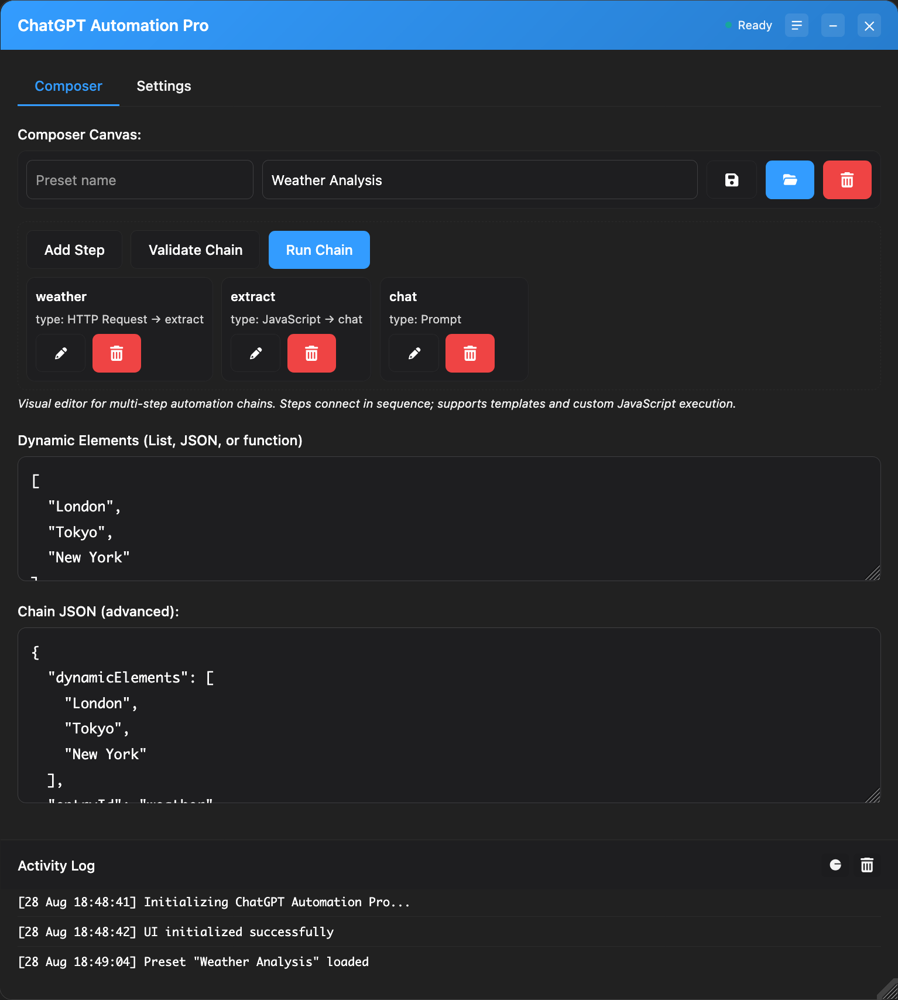

# ChatGPT Automation Pro

Automate ChatGPT in your browser. Type → send → wait → run your code. Batch‑friendly. Zero copy‑paste.

<banner alt="ChatGPT Automation Pro banner"/>

> **Why this exists** — Prompting is easy. Repeating it 100× with clean logs, templating, and API glue isn’t. This gives you an on‑page automation panel that behaves like a tiny orchestration tool.

---

## Highlights

* **On‑page automation panel** — compose multi‑step chains (Prompt → JS → HTTP → Prompt).
* **Batch mode** — JSON arrays, objects, or generator functions. `{item}`, `{index}`, `{steps.id.response}` supported.
* **JS sandbox** — post‑reply JavaScript with `response`, `steps`, `http`, `utils.log`.
* **HTTP proxy** — background service worker makes cross‑origin calls (GM‑style).
* **Image capture** — auto‑extract generated image URLs.
* **Theme‑aware UI** — dark/light, draggable, resizable, persistent state.


---

## Install

**Option A — Userscript (fastest)**

1. Install Tampermonkey.
2. Open the raw script URL and install: `<userscript_raw_url/>`.
3. Go to chat.openai.com (or chatgpt.com) → click **Automation** in the header.

**Option B — Browser Extension (Chrome/Edge/Firefox)**

* Load unpacked from `webextension/` (contains `manifest.json`).
* Or build the distributable ZIP.

```bash
# Build the distributable extension zip
webextension/package.sh
# → dist/chatgpt-automation-pro-extension.zip
```

**Quick verify**

1. Click **Automation**.
2. Dynamic Elements: `["London","Paris","Tokyo"]`
3. Chain JSON:

```json
{
  "entryId": "step1",
  "steps": [
    { "id": "step1", "type": "prompt", "template": "Tell me 1 fun fact about {item}" }
  ]
}
```

4. Run. Watch it process all cities.

---

## Core concepts

* **Chain steps**: `prompt`, `template` (batch), `js`, `http`.
* **Templating**: `{item}`, `{index}`, `{total}`, `{steps.stepId.response}`, `{steps.httpId.data}`.
* **Context for JS**: `response, item, index, total, steps, http, utils.log`.

Example: API → JS → Prompt

```json
{
  "dynamicElements": ["Tokyo","London"],
  "entryId": "weather",
  "steps": [
    { "id": "weather", "type": "http", "url": "https://wttr.in/{item}?format=j1", "method": "GET", "next": "extract" },
    { "id": "extract", "type": "js", "code": "const d=JSON.parse(steps.weather.rawText); return d.current_condition[0].temp_C + '°C';", "next": "chat" },
    { "id": "chat", "type": "prompt", "template": "In {item} it\u2019s {steps.extract.response}. What should I wear?" }
  ]
}
```

---

## Contribute

Issues and PRs welcome. If this saves you time, **⭐️ star the repo** — it helps others find it.

